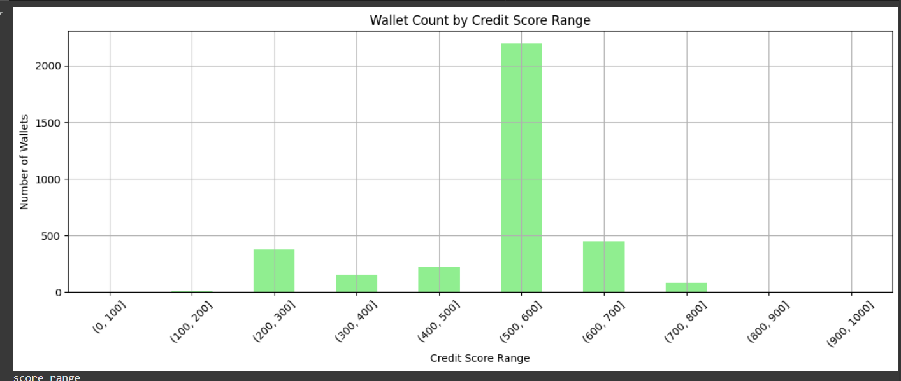

---

## ✅ `analysis.md` – for score insights and behavior patterns

This file explains what the scores mean, how they’re distributed, and how wallets behave at different score levels.

---

```markdown
# Credit Score Analysis

## 🧾 Summary

After scoring 3500+ wallets based on their transaction behavior in Aave V2, we observed the following:

- Scores range between 0 and 800+, with most wallets concentrated in **500–600**
- Very few wallets exceeded a score of 800
- This indicates strong filtering by our formula against risky/low-quality usage

## 📊 Credit Score Distribution

### Score Buckets

| Credit Score Range | Wallet Count | Interpretation        |
|--------------------|--------------|------------------------|
| 0–100              | 0            | Absent                |
| 100–200            | ~2           | Extremely risky       |
| 200–300            | ~350         | Mostly inactive       |
| 300–400            | ~150         | Low engagement        |
| 400–500            | ~230         | Moderate risk         |
| 500–600            | ~2200        | Trusted core users    |
| 600–700            | ~450         | High-value users      |
| 700–800            | ~75          | Very responsible      |
| 800–1000           | 0            | Top-tier (none found) |

## 📌 Behavior of Wallets

### 🔻 Low-Score Wallets (< 300)

- Very low `repay_ratio` (often 0)
- Usually active for less than 5 days
- One or two actions (e.g. single borrow, no repayment)
- Higher liquidation risk

### 🔺 High-Score Wallets (600–800)

- Excellent repayment behavior (ratio > 0.8)
- Long-term users with >100 days of activity
- Multiple deposits/borrows/repayments
- Zero liquidations
- Likely long-term DeFi participants

## 📎 Insights

- The current scoring favors long-term, active, and reliable wallets
- Bots, exploits, or one-off users are effectively filtered out
- No wallets crossed the 800 threshold, indicating very tight top score criteria

## ✅ Recommendation

- Treat **scores above 700** as reliable for lending/whitelisting
- Use scores below 400 with caution—likely untrustworthy or risky
- Consider integrating credit_score into risk engines or interest rate logic

## 📁 Visualization

See histogram plot in `credit_score_model.ipynb` or below:

> 

---

